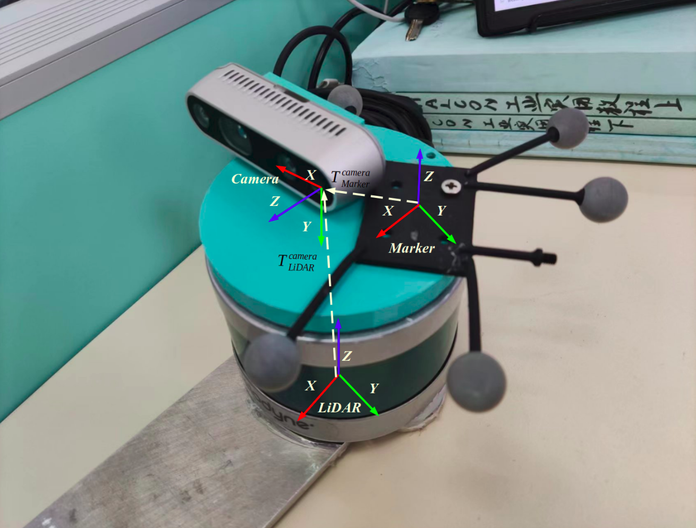

# Camera-LiDAR 联合标定工具

## 原理
采用相机和激光雷达同时捕捉标定棋盘的信息来求解位姿。对于相机：捕捉棋盘格的角点通过PnP算法来计算棋盘格与相机的相对位姿，计算棋盘格边缘四个角点的坐标和中心点坐标和朝向向量;对于激光雷达，手动过滤掉背景点只保留在扫描在棋盘格的点云，进行平面拟合，得到棋盘格最边缘四个角点和中心点的坐标和朝向向量，根据实际标定板的尺寸来获得棋盘格与激光雷达的相对位姿。在的到多组数据后优化从lidar到camera的旋转量和平移量。

## 安装
先要安装[ROS](http://wiki.ros.org/cn/ROS/Installation)和PCL，该程序已在Ubuntu20.04下测试运行。
~~~shell
sudo apt install ros-noetic-pcl*
mkdir -p sensor_calibration_ws/src
cd sensor_calibration_ws/src
git clone https://github.com/Xujianhong123Allen/sensor_calibration.git
cd ..
catkin build
source devel/setup.bash
~~~

## 标定

1. **准备标定板**：把激光雷达（机械旋转多线激光雷达如Velodyne VLP16）和相机固联在一起后，找到一个标定板，棋盘格（[此处在线生成](https://markhedleyjones.com/projects/calibration-checkerboard-collection)）打印成纸张后尽量平整地贴在一个刚性的平面，减少平面皱折而引起标定误差。如果你使用的相机分辨率较小（如640×480），标定棋盘格实际尺寸应选择较小（A3纸张），标定时的距离应较近（1米以内），当距离过远，而导致角点像素小计算相机与棋盘格相对位姿不精确。

   相机雷达装置如下所示：

   

2. **修改标定参数文件**：打开[initial_params.yaml](./cfg/initial_params.yaml)文件。修改的信息包括：图像话题，激光点云话题，标定棋盘的参数：内角点数量（长×宽，而不是方格的数量）、每个格子的大小（单位：毫米），标定板实际尺寸，棋盘纸中心与标定板中心的偏移，相机的内参矩阵$K$和失真系数$D$，图像分辨率。其中相机的内参标定可利用[ROS的相机标定程序](http://wiki.ros.org/calibration)。

   例如：

   对应的参数文件：

   ~~~yaml
   # 标定棋盘格的参数：内角点数量（长×宽）、每个格子的尺寸（毫米）
   chessboard:
     lenght: 11 
     width: 8
     grid_size: 25
   
   # 标定板实际尺寸大小（毫米）
   board_dimension:
     lenght: 340
     width: 260
   
   # 棋盘纸中心与标定板中心的偏移
   translation_error:
     lenght: 0
     width: 0
   ~~~

3. **正式开始相机雷达标定**：

   先开启激光雷达和相机驱动的节点（根据自己的设备而开启）

   在我的设备中采用的是Velodyne VLP16和Realsense D435进行联合标定

   在确保有图像和点云数据话题后，运行命令：

   ~~~shell
   roslaunch cam_lidar_calibration cam_lidar_calibration.launch 
   ~~~

   在rviz中调整rqt_reconfigure窗口过滤背景点云，保留激光雷达扫在标定板上的点云。输入i，采集一个样本进行拟合平面，如果拟合出来平面比较符合真实情况则输入会车Enter确认采集这个样本，如果拟合的效果较差，重复多次输入i或者移动标定板重新拟合。在采集多组数据后（大于15组），按下o，进行优化，进行相机雷达外参计算，得到lidar to camera 的变换矩阵，结果将会保存到calibration_result文件夹中

   在拟合过程中如果因为标定板四条边的点云不明显，有可能平面拟合失败例如：

   

   应该移动标定板，让其扫描均匀得到好的拟合效果

   

4. 重投影点云：

   开启激光雷达和相机驱动数据，将[project_img.launch](./launch/project_img.launch)的

   ~~~xml
   <param name="cfg" type="string" value="$(find cam_lidar_calibration)/calibration_result/calibration.yaml" />
   ~~~

   改为自己刚刚标定完生成的标定结果文件

   运行：

   ~~~shell
   roslaunch cam_lidar_calibration project_img.launch 
   ~~~

   

