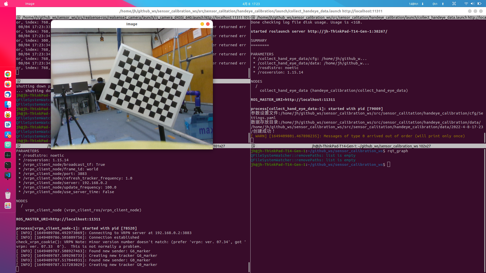

# 手眼标定程序功能包

## 简介

该程序可用于机械臂（UR3、UR5等）末端执行器和相机之间的变换矩阵的计算，也可用于计算在真值评估中Motion Capture的marker与相机之间的转换矩阵，使用的模型都是眼在手上eye in hand的模型。

## 编译安装

先要安装ROS，该程序已在Ubuntu20.04下测试运行。

~~~shell
mkdir -p sensor_calibration_ws/src
cd sensor_calibration_ws/src
git clone https://github.com/Xujianhong123Allen/sensor_calibration.git
cd ..
catkin build
source devel/setup.bash
~~~

---

## 运行

以真值评估中Motion Capture下marker与camera之间的变换矩阵为例：

1. 将相机和marker固联起来，建立marker的刚体，使用vrpn传输Motion Capture的marker pose数据，开启相机驱动节点。

2. 修改参数配置文件[Settings.yaml](./cfg/Settings.yaml)，修改标定板的尺寸、相机话题名称、marker pose的话题名称、相机内参矩阵和失真系数。其中相机标定可参考[ROS的相机标定](http://wiki.ros.org/camera_calibration)。

3. 采集标定数据：运行命令

   ~~~shell
   roslaunch handeye_calibration collect_handeye_data.launch 
   ~~~

   会出现图像窗口：

   

   在窗口终端按下s或S键，保存数据，移动相机，采集至少15份数据来保证数据准确精度。按下e或者E保存数据到文件并退出程序，数据将会保存在data文件夹下，会以日期时间创建文件夹。

4. 运行手眼标定：

   修改[calibration_handeye.launch](./launch/calibration_handeye.launch)的

   ~~~xml
    <param name="data" type="string" value="$(find handeye_calibration)/data/" />
   ~~~

   修改存放数据文件夹名称，后运行标定程序命令：

   ~~~shell
   roslaunch handeye_calibration calibration_handeye.launch 
   ~~~

   标定结果会保存在与数据同目录下的handeye_result.yaml。

marker与camera坐标系如图：

当需要使用机械臂的手眼标定，在程序中给出了使用UR3的例子程序，在collect_hand_eye_data.cpp中，取消注释，替换成对应的机械臂话题即可

~~~cpp
 /******************************************************************************************************/
    // UR3 末端执行器和camera之间的手眼标定
/******************************************************************************************************/
~~~

