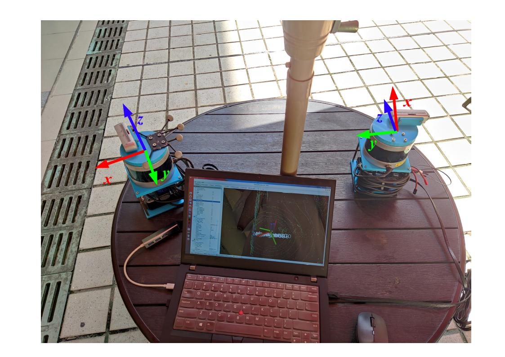
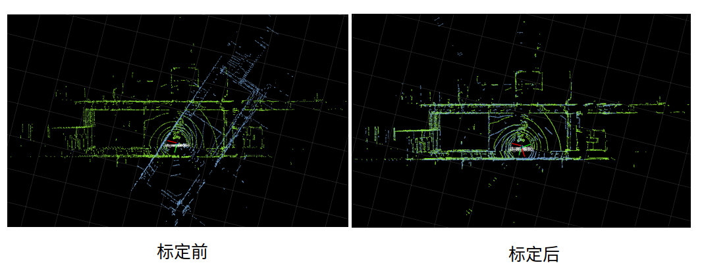
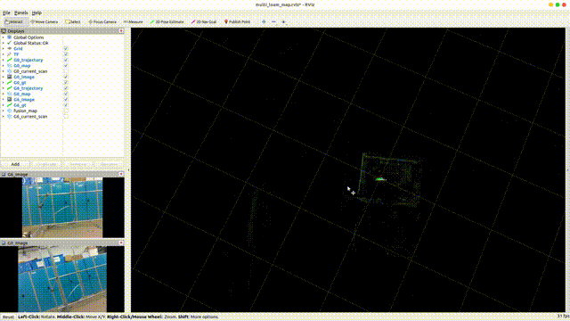

# multi_LiDAR_calibration
## 介绍

该算法包用于标准两个激光雷达的外参数变换矩阵，先用A-LOAM进行建立点云地图，将两个点云地图进行ICP配准，比直接用两帧原始的激光点云扫描帧进行ICP配准会更精确一些。其中A-LOAM代码改动了一部分，加入命名空间来区分，删除了关于`KittiHelp.cpp`。[博客说明](https://blog.csdn.net/weixin_41681988/article/details/125470567?spm=1001.2014.3001.5501)。

## 安装使用

### 1.系统环境

- **Ubuntu ROS**：该算法包在Ubuntu20.04 ROS Noetic下进行开发的，版本向下兼容，Ubuntu18.04 melodic、16.04 kinetic同样使用，[ROS的安装](http://wiki.ros.org/ROS/Installation)

- **ceres Solver**：参照 [Ceres Installation](http://ceres-solver.org/installation.html)

- **PCL**：安装ROS后一般都自动安装好PCL，如果没有则命令安装

  ~~~shell
  sudo apt install ros-noetic-pcl-ros
  ~~~

### 2.编译

~~~shell
mkdir -p calibration_ws/src
cd calibration_ws/src
git clone https://github.com/HKUST-Aerial-Robotics/A-LOAM.git
cd ..
catkin build multi_LiDAR_calibration 
source devel/setup.bash
~~~

### 3.运行测试

~~~shell
# 开启标定程序
roslaunch multi_LiDAR_calibration multi_lidar_calibration.launch
# 在新的一个终端中开启数据
rosbag play test1_2022-06-25-09-48-57.bag
~~~

此时便会出现Rviz，标定应该是瞬间完成的，终端输出结果：

~~~shell
Mapping 10 Hz 
scan line number 16 
process[G6/laserMapping-8]: started with pid [25155]
process[G6/mocap_to_map_tf-9]: started with pid [25161]
line resolution 0.200000 plane resolution 0.400000 
process[multi_map_fusion-10]: started with pid [25163]
process[rviz-11]: started with pid [25172]
Mapping 10 Hz 
scan line number 16 
line resolution 0.200000 plane resolution 0.400000 
参数配置文件 :/home/jh/github_ws/sensor_calibration_ws/src/sensor_calitation/multi_LiDAR_calibration/cfg/param.yaml
file map_match_min_num: 1500
Initialization finished 
[ WARN] [1656214415.312059554]: time Map corner and surf num are not enough
Initialization finished 
[ WARN] [1656214415.322764144]: time Map corner and surf num are not enough
Fitness score: 0.502675
雷达初始坐标系变换矩阵估计完成, 变换矩阵T base->distribution:
    0.984975   -0.171714   0.0184061   0.0100743
   0.172489    0.983413  -0.0560997     0.68502
-0.00846776   0.0584317    0.998255    0.309399
          0           0           0           1
估计时间： 0.059558s 
~~~

结果如下所示：

实际激光雷达朝向：

标定结果：

这里提供一些数据测试：

百度网盘：https://pan.baidu.com/s/1-JaNR75FynGWdVXujfNj3A， 提取码tfum

在README.md中有初始位姿说明。

### 4.运行自己的激光雷达标定

在录制一个约10s的数据包rosbag，两个激光雷达命令空间自行设定，但是在该程序中命名空间设定为`/G0`（base）和`/G6`（distribution），需要将自己的激光雷达数据包的话题名称映射成`/G0/velodyne_points`和`/G6/velodyne_points`，使用下面的命令：

~~~shell
rosbag play XXX.bag /XX_ns1/velodyne_points:=/G0/velodyne_points /XX_ns2/velodyne_points:=/G6/velodyne_points 
~~~

关于ROS同时驱动多个velodyne见博客https://blog.csdn.net/CCCrunner/article/details/106501681

关于[参数配置](./cfg/param.yaml)，包括给定初始的变换矩阵，参数$(x,y,z,roll,pitch,yaw)$，其中$yaw$角度从上往下看逆时针为正，激光雷达点云地图配准所需最少点数量，默认1200

### 5.多机协同

该算法包提供了简单多机协同SLAM，将两个A-LOAM系统加入全局坐标系中效果如下：

---

## 致谢

感谢[A-LOAM](https://github.com/HKUST-Aerial-Robotics/A-LOAM)、[calibration_kit](https://github.com/calibtoolkit/calibration_kit/blob/main/calibration_algorithm/lidar2lidar/lidar2lidar.cpp)

